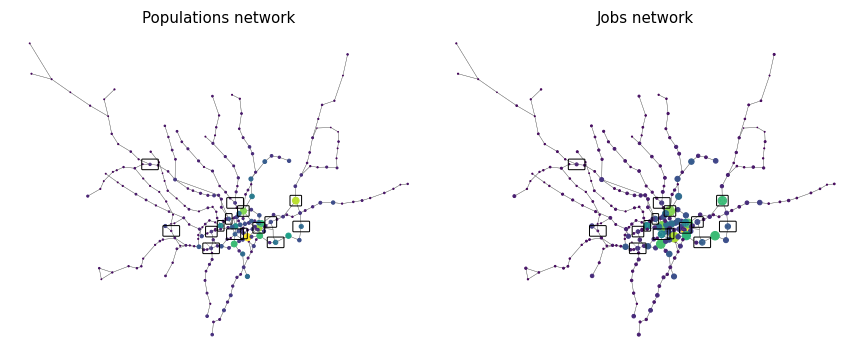
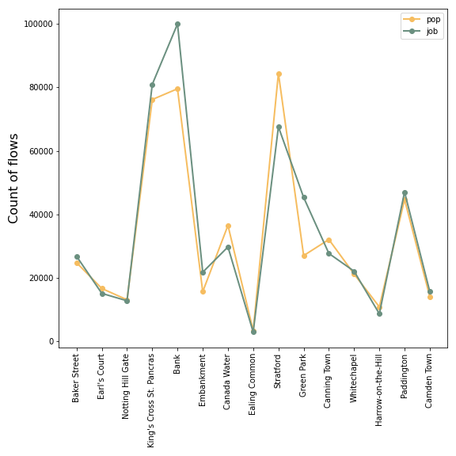
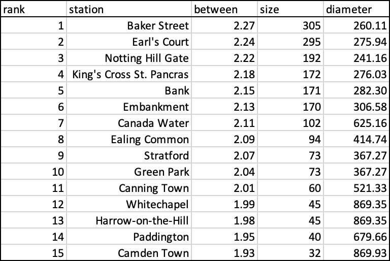

Urban Simulation Coursework

---

# 1. London’s underground resilience

In this part, the London's tube would be transferred into a network and 10 nodes of it would be eliminated based on 3 centrality measures following 2 differnt strategies.

## 1.1. Measures

The 3 ***centrality*** measures would be introduced in the report are: 

- **degree centrality** 
According to Freeman (1979), within a network, a point with a high degree, would be considered as "in the thick of things" which should be part of the mainstream of information flow. In short, it is the number of edges that link to the point.

- **betweenness centrality**
Another measure about nodes is defined as betweenness, which calcualtes the sum of the number of the shortest paths that pass through the vertex. With a low value, it would be less possible to express the network which is lack of centrality.

- **closeness centrality**
Freeman also defined the closeness centrality of a node, which is a sum of all shortest path between it and other nodes. If it is low for a point, it indicates it should rely on other points to deliver information which illustrates a weak centrality.

The 2 ***evaluation*** measure of centrality are:

- **giant component size of network**
It calculates the sum of rest nodes in the network after the elimination of the node.

- **normalized diameter of the network**
It equals to the the maximum of the calcualted shortest path in a network after the removal of the vertex.

The **criterion of elimination** is to start with the node that has the highest value of centrality. Notice the highest "node" could be different for 3 different centrality measurements. After each removal, calculate the size and diameter of the network. In addition, there are 2 distinct **strategies** to follow. For sequential strategy, after calculating the size and diameter of removing last point, the calculation of the 3 centrality measures should be computed once again to get the next point that need be deleted. And this step of computation should be running at each step. But for non-sequential strategy, it is enough to just follow the list of first calculation of centrality to delete nodes and get the corresponding sizes and diameters.

To consider **applicability** of these 2 evaluations, it is able to measure the resilience of not only London underground but also other network. The logic behind this is to firstly "attack" the network by selecting some most important nodes in the network and eliminating them, then evaluate how many information the updated network would still contain. In other words, without considering flow, just for network, it wants to know how the left network would react after losing "essential" points.

While thinking about the **selection** of measures, notice with more nodes being deleted, unconnected part appears, and the network would get smaller and smaller until finally cannot be considered as a network which means value 0 of size would decrease to 0. And for diameter, as the network gradually disintegrates, the number of nodes would decrease accompanied by the decreasing number of edges, the diameter which is the longest shortest path should be larger.

That is to say, though there are different types of network, with removing "important" nodes, size would always drop, and diameter would always rise. It should be noted that there may be fluctuations in growth or decline, and also the degree of growth and decline may vary depending on the type of network. Therefore, these should be carefully discussed in analysis. In general, if a network has a good performance in resilience, it should have relatively small changes in size and diameter after removing nodes, vice versa.

## 1.2. Analysis

¬Below is the sketch of the network graph of London Tube. Red points are stations and grey edges are the link between them. As in network, direction is not important, there is no arrow in this part.

In this analysis, to ensure enough iteration of measurements, every centrality method would all move 15 vertexes. For better visualisation of comparison, show the 2 different strategies side by side, while left is for non-sequential and right for sequential. Firstly, use network graph to show the change in map. Then, use line graph to compare stations with corresponding sizes and diameters.

Following the order of centrality measure above, look at **degree** centrality first.

In Figure 2, there is no obvious difference by comparing them in map. The deleted points are both relatively concentrated in the city centre and its below.

While checking the station list, the first 4 stations are exactly the same, which are **Baker Street, King's Cross St. Pancras, Waterloo and Oxford Circus**. Besides, there is no particular difference in the degree of decline in size and uplift in diameter. For non-sequential, degree goes down from 306 to 169, while diameter goes up from 260.11 to 525.87. For sequential, degree decreases from 306 to 135, while diameter increases from 260.11 to 431.35. In terms of size, it seems that sequential is better. But in diameter, non-sequential is better. The result is expected as London Tube is a scale-free network with limited nodes having high degrees. That is to say, sequential or non-sequential has little impact on degree calculation. Thus, it is inclusive to tell which is better to evaluate this centrality measure. And degree is possibly not suitable for measure resilience of London Tube.

Then check the results from **betweennness**.

In figure 4, it is clear that for non-sequential, the selected points are clustered in the central of the city and very close to each other, while for sequential, the location of the deleted points is far more dispersed. The station list in left and right are significantly different. Even without checking the detailed figures, it is known that **sequential has the better performance**.

One interesting finding is in the upper left size plot, there is distinct decrease after removing **South Kensington**. It is reasonable as it is the intersection station of 3 metro lines,  District, Circle and Piccadilly. And for the upper right size plot, the serious dropping points occur at removing **Notting Hill Gate and Canada Water**. Notting Hil Gate is not only the changing station of 3 lines, District, Circle and Central but also the boundary of Zone 1 and 2. Canada Water is the crossing station of Overgound and Jubilee and is topped at the list of the most crowded stations. In addition, it is the closest changing station of Canary Wharf.

The left diameter line is less informative. But the right one is more interesting. After deleting the stations **Ealing Common**, **Stratford** and **Paddington**, the curve that should have gone up, but instead drop. Recall the definition of diameter is the longest shortest path, which is in other words, the shortest path between the 2 most distant nodes. There is a strong possibility that this is because the 2 most distant nodes are different before and after elimination. The removal of these points disconnects the network where the previous longest shortest path is located. And new network with smaller size would doubtlessly has shorter diameter than the larger one. In brief, elimination of points results in disconnection of network and newly produced network affects the diameter. From this perspective, **diameter is more sensitive to the changes of network than size within sequential strategy**.

It is the turn to check **closeness**.

In figure 6, it is similar as betweenness. The results of non-sequential tend to concentrate in the city centre and the one of sequential is more spread out.

For the upper left graph of size, it has the largest size among the three centrality measures after nodes removal, which is 249. Though its diameter result is not as bad as size, this strategy is inefficient. After carefully looking into the nodes, they are all located around SOHO area, which is not a surprise. Because non-sequential method doesn't require recalculation of closeness centrality. Then it would always ignore the influence of disconnection of network.

For the right diagrams, the huge drop of size happens after removing the station **King's Cross St. Pancras**, following the distinct growth of diameter. It is expected as it is calculated as the busiest London tube station for several years.

## 1.3. Discussion.

Before drawing conclusions, it is necessary to add all methods together and make comparisons. At this stage, the exact station list is not the same important as before. So label them as number in x axes to visulise the methods.

Among these 12 methods, the **most relevant** method of analyzing London underground is using sequential strategy on betweenness centrality. It is shows as the red curves on the right-hand side diagrams. One major reason is it is the most sensitive one to the disconnection of network. Notice non-sequential totally ignores the disconnection. While dropping station points, it has the largest fluctuations in diameter curve. However, its **limitation** is also obvious. It only meausres the distance among stations without caring about the flow of passengers. Notice the current framework of underground was constructed many years ago. But society is developing day by day, so does people's demand of taking tubes.

Being appropriate for discussing London underground is not equal to the same suitability for other networks. The relevance highly depends on the type and property of each network. Betweenness is widely used to find the "bridge" from one part of network to another.

In addition, closeness is the method that care "too much" about distance which doesn't perform well in this case, though sequential performs a bit better than non-sequential. Resilience is not just about distance. For both sequential and non-sequential, degree centrality hardly works for this case, because distance is not the thing it cares.

At the end, there is a general limitation of the node’s removal approach. After dropping more and more points, the structure of network would be affected more and more. One concern is there might exist some important nodes in the disconnected area which would no longer be considered.

# 2. Networks with flows and Spatial Interaction models

## 2.1. Network and Flow

The centrality selected from part 1 is the sequential betweenness method. The detailed table is shown on the right-hand side in figure 10. As the flow from original station to destination means the number of population and jobs respectively, they should be plotted one by one. In figure 9, the removed 15 nodes are squared. Another diagram in figure 10 are the number of flows corresponding to each station. It is obvious that there are 4 stations, **King's Cross St. Pancras, Bank, Stratford and Paddington** which have large number of flows in both populations and jobs. Thus, their removal would bring inevitable influence on the network even without recomputing the measures.

Same as part 1, it would still follow the order from degree, betweenness to closeness to present the results and discussion. For better view, the recomputing stuff are all located on the L.H.S while the previous plots on the R.H.S. Notice the station matrix in part 1 is 306 x 306, while in this part is 265 x 265. So the y-axis in the line graph should not be aligned.

In figure 11, the distribution of selected nodes on the upper left are more dispersive. While checking this carefully in figure 12, it is found that the first 9 selected stations, from Baker street to Green Park, are the same. The difference is slight. Also, the 4 stations mentioned above, 3 of them (without Stratford) are considered as important.

![fig 13]

![fig 14]

In figure 13, both distribution look fine. While checking details in figure 14, it is found that the order of "important" station list change a lot. Different from the previous one, the new measure ranks **Green Park** at first. It is reasonable for a station with 3 lines passing through. Considering the 4 stations with huge inflows and outflows in calculation, **King's Cross** and **Bank** are ranked higher than before.

![fig 15]

![fig 16]

In figure 15, the new distribution is more clustered than previous one. The reason should link to the new factor, weight, which is calculated by flows. As mentioned before, closeness measure is the one "care a lot" about distance. 

In line digrams, there are 2 similarities like betweenness. The first one is station list still changes seriously. Then the other is **Green Park** still has the highest ranking of importance. In contrast, **Bank** has higher ranking but **King's Cross** drops.

For the issue about vulnerability, degree is the most unresponsive and betweenness is the most sensitive. Besides, it is learnt that while considering how to take flow into account, more discussion about weight should be drawn attention to.

## 2.2. Spatial Interaction Models

There are 3 types of interaction models:

- The Unconstrained Model

$T_{ij} = k \frac{O_i^\alpha D_j^\gamma}{d_{ij}^\beta}$

- Singly Constrained Model

- Doubly Constrained Model

## 2.3. 

sankey?? 

---
----

# 3. References

Freeman, L. C. (1979) ‘Centrality in social networks’, *Social Networks*, 1(3), pp. 215– 239. doi: 10.1016/0378-8733(78)90021-7.

---
# 4. Appendix

Notice MultiDiGraph and DiGraph

Notice missing flows in original file. Need to calculate the distance once again.
